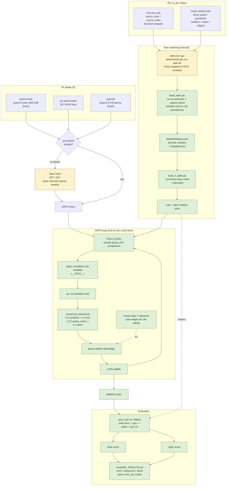

# Reinforcement Learning Workflow

**Legend.** Green = scaffolding built + validated (branch `rl-phase`). Amber = remaining owner work: author ≥30 drivers (`DRV`) and warm-start the two fresh bases (`RFT`). The GRPO loop itself is proven end-to-end on a real 30B (2-iter smoke: reward loaded, rollouts scored, adapter produced). See [`strat.md`](strat.md) for the full rationale.
